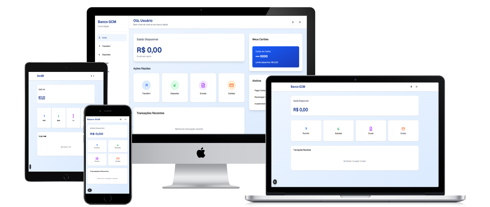

# Banco-GCM

Projeto da Disciplina de **Gerência e Configuração de Mudança**.

Membros:
- Pedro Henrique Alexandre
- Thiago dos Santos Araujo 
- Vinicius Cavalcante Pequeno


## 📑 Sumário
- [Estrutura do Projeto](#estrutura-do-projeto)
- [Itens de Configuração do Software](#itens-de-configuração-do-software)
  - [Arquivos Gerais](#arquivos-gerais)
  - [Front-end Web](#front-end-web)
  - [Front-end Desktop](#front-end-desktop)
  - [Front-end Mobile](#front-end-mobile)
  - [Back-end](#back-end)
- [Passos para Executar](#passos-para-executar)

## Aplicação

<div align="center">
  
</div>

## Estrutura do Projeto

```
Directory structure:
└── viniciuscavalcantepequeno-banco-gcm/
    ├── README.md
    ├── package.json
    ├── config/
    │   ├── docker-compose.yml
    │   └── jest.config.js
    ├── docs/
    │   ├── api-endpoints.md
    │   ├── arquitetura.md
    │   ├── manual-usuario.md
    │   └── requisitos.md
    ├── packages/
    │   ├── backend/
    │   │   ├── package.json
    │   │   ├── config/
    │   │   │   └── config.yaml
    │   │   └── src/
    │   │       ├── server.js
    │   │       ├── controllers/
    │   │       │   ├── accountController.js
    │   │       │   ├── transactionController.js
    │   │       │   └── userController.js
    │   │       ├── middlewares/
    │   │       │   └── authMiddleware.js
    │   │       ├── models/
    │   │       │   ├── Account.js
    │   │       │   ├── Transaction.js
    │   │       │   └── User.js
    │   │       ├── routes/
    │   │       │   ├── accountRoutes.js
    │   │       │   ├── transactionRoutes.js
    │   │       │   └── userRoutes.js
    │   │       ├── services/
    │   │       │   ├── accountService.js
    │   │       │   ├── transactionService.js
    │   │       │   └── userService.js
    │   │       └── utils/
    │   │           └── transacationUtils.js
    │   ├── database/
    │   │   ├── database.js
    │   │   └── package.json
    │   └── frontend/
    │       ├── desktop/
    │       │   ├── components.json
    │       │   ├── next.config.mjs
    │       │   ├── package.json
    │       │   ├── pnpm-lock.yaml
    │       │   ├── postcss.config.mjs
    │       │   ├── tsconfig.json
    │       │   ├── app/
    │       │   │   ├── globals.css
    │       │   │   ├── layout.tsx
    │       │   │   ├── page.tsx
    │       │   │   ├── home/
    │       │   │   │   └── page.tsx
    │       │   │   └── login/
    │       │   │       └── page.tsx
    │       │   ├── components/
    │       │   │   ├── theme-provider.tsx
    │       │   │   └── ui/
    │       │   │       ├── accordion.tsx
    │       │   │       ├── alert-dialog.tsx
    │       │   │       ├── alert.tsx
    │       │   │       ├── aspect-ratio.tsx
    │       │   │       ├── avatar.tsx
    │       │   │       ├── badge.tsx
    │       │   │       ├── breadcrumb.tsx
    │       │   │       ├── button-group.tsx
    │       │   │       ├── button.tsx
    │       │   │       ├── calendar.tsx
    │       │   │       ├── card.tsx
    │       │   │       ├── carousel.tsx
    │       │   │       ├── chart.tsx
    │       │   │       ├── checkbox.tsx
    │       │   │       ├── collapsible.tsx
    │       │   │       ├── command.tsx
    │       │   │       ├── context-menu.tsx
    │       │   │       ├── dialog.tsx
    │       │   │       ├── drawer.tsx
    │       │   │       ├── dropdown-menu.tsx
    │       │   │       ├── empty.tsx
    │       │   │       ├── field.tsx
    │       │   │       ├── form.tsx
    │       │   │       ├── hover-card.tsx
    │       │   │       ├── input-group.tsx
    │       │   │       ├── input-otp.tsx
    │       │   │       ├── input.tsx
    │       │   │       ├── item.tsx
    │       │   │       ├── kbd.tsx
    │       │   │       ├── label.tsx
    │       │   │       ├── menubar.tsx
    │       │   │       ├── navigation-menu.tsx
    │       │   │       ├── pagination.tsx
    │       │   │       ├── popover.tsx
    │       │   │       ├── progress.tsx
    │       │   │       ├── radio-group.tsx
    │       │   │       ├── resizable.tsx
    │       │   │       ├── scroll-area.tsx
    │       │   │       ├── select.tsx
    │       │   │       ├── separator.tsx
    │       │   │       ├── sheet.tsx
    │       │   │       ├── sidebar.tsx
    │       │   │       ├── skeleton.tsx
    │       │   │       ├── slider.tsx
    │       │   │       ├── sonner.tsx
    │       │   │       ├── spinner.tsx
    │       │   │       ├── switch.tsx
    │       │   │       ├── table.tsx
    │       │   │       ├── tabs.tsx
    │       │   │       ├── textarea.tsx
    │       │   │       ├── toast.tsx
    │       │   │       ├── toaster.tsx
    │       │   │       ├── toggle-group.tsx
    │       │   │       ├── toggle.tsx
    │       │   │       ├── tooltip.tsx
    │       │   │       ├── use-mobile.tsx
    │       │   │       └── use-toast.ts
    │       │   ├── hooks/
    │       │   │   ├── use-mobile.ts
    │       │   │   └── use-toast.ts
    │       │   ├── lib/
    │       │   │   ├── auth.ts
    │       │   │   ├── security.ts
    │       │   │   └── utils.ts
    │       │   └── styles/
    │       │       └── globals.css
    │       ├── mobile/
    │       │   ├── components.json
    │       │   ├── next.config.mjs
    │       │   ├── package.json
    │       │   ├── pnpm-lock.yaml
    │       │   ├── postcss.config.mjs
    │       │   ├── tsconfig.json
    │       │   ├── app/
    │       │   │   ├── globals.css
    │       │   │   ├── layout.tsx
    │       │   │   ├── page.tsx
    │       │   │   ├── home/
    │       │   │   │   └── page.tsx
    │       │   │   └── login/
    │       │   │       └── page.tsx
    │       │   ├── components/
    │       │   │   ├── theme-provider.tsx
    │       │   │   └── ui/
    │       │   │       ├── accordion.tsx
    │       │   │       ├── alert-dialog.tsx
    │       │   │       ├── alert.tsx
    │       │   │       ├── aspect-ratio.tsx
    │       │   │       ├── avatar.tsx
    │       │   │       ├── badge.tsx
    │       │   │       ├── breadcrumb.tsx
    │       │   │       ├── button-group.tsx
    │       │   │       ├── button.tsx
    │       │   │       ├── calendar.tsx
    │       │   │       ├── card.tsx
    │       │   │       ├── carousel.tsx
    │       │   │       ├── chart.tsx
    │       │   │       ├── checkbox.tsx
    │       │   │       ├── collapsible.tsx
    │       │   │       ├── command.tsx
    │       │   │       ├── context-menu.tsx
    │       │   │       ├── dialog.tsx
    │       │   │       ├── drawer.tsx
    │       │   │       ├── dropdown-menu.tsx
    │       │   │       ├── empty.tsx
    │       │   │       ├── field.tsx
    │       │   │       ├── form.tsx
    │       │   │       ├── hover-card.tsx
    │       │   │       ├── input-group.tsx
    │       │   │       ├── input-otp.tsx
    │       │   │       ├── input.tsx
    │       │   │       ├── item.tsx
    │       │   │       ├── kbd.tsx
    │       │   │       ├── label.tsx
    │       │   │       ├── menubar.tsx
    │       │   │       ├── navigation-menu.tsx
    │       │   │       ├── pagination.tsx
    │       │   │       ├── popover.tsx
    │       │   │       ├── progress.tsx
    │       │   │       ├── radio-group.tsx
    │       │   │       ├── resizable.tsx
    │       │   │       ├── scroll-area.tsx
    │       │   │       ├── select.tsx
    │       │   │       ├── separator.tsx
    │       │   │       ├── sheet.tsx
    │       │   │       ├── sidebar.tsx
    │       │   │       ├── skeleton.tsx
    │       │   │       ├── slider.tsx
    │       │   │       ├── sonner.tsx
    │       │   │       ├── spinner.tsx
    │       │   │       ├── switch.tsx
    │       │   │       ├── table.tsx
    │       │   │       ├── tabs.tsx
    │       │   │       ├── textarea.tsx
    │       │   │       ├── toast.tsx
    │       │   │       ├── toaster.tsx
    │       │   │       ├── toggle-group.tsx
    │       │   │       ├── toggle.tsx
    │       │   │       ├── tooltip.tsx
    │       │   │       ├── use-mobile.tsx
    │       │   │       └── use-toast.ts
    │       │   ├── hooks/
    │       │   │   ├── use-mobile.ts
    │       │   │   └── use-toast.ts
    │       │   ├── lib/
    │       │   │   ├── auth.ts
    │       │   │   ├── security.ts
    │       │   │   └── utils.ts
    │       │   └── styles/
    │       │       └── globals.css
    │       └── web/
    │           ├── components.json
    │           ├── next.config.mjs
    │           ├── package.json
    │           ├── pnpm-lock.yaml
    │           ├── postcss.config.mjs
    │           ├── tsconfig.json
    │           ├── app/
    │           │   ├── globals.css
    │           │   ├── layout.tsx
    │           │   ├── page.tsx
    │           │   ├── home/
    │           │   │   └── page.tsx
    │           │   └── login/
    │           │       └── page.tsx
    │           ├── components/
    │           │   ├── theme-provider.tsx
    │           │   └── ui/
    │           │       ├── accordion.tsx
    │           │       ├── alert-dialog.tsx
    │           │       ├── alert.tsx
    │           │       ├── aspect-ratio.tsx
    │           │       ├── avatar.tsx
    │           │       ├── badge.tsx
    │           │       ├── breadcrumb.tsx
    │           │       ├── button-group.tsx
    │           │       ├── button.tsx
    │           │       ├── calendar.tsx
    │           │       ├── card.tsx
    │           │       ├── carousel.tsx
    │           │       ├── chart.tsx
    │           │       ├── checkbox.tsx
    │           │       ├── collapsible.tsx
    │           │       ├── command.tsx
    │           │       ├── context-menu.tsx
    │           │       ├── dialog.tsx
    │           │       ├── drawer.tsx
    │           │       ├── dropdown-menu.tsx
    │           │       ├── empty.tsx
    │           │       ├── field.tsx
    │           │       ├── form.tsx
    │           │       ├── hover-card.tsx
    │           │       ├── input-group.tsx
    │           │       ├── input-otp.tsx
    │           │       ├── input.tsx
    │           │       ├── item.tsx
    │           │       ├── kbd.tsx
    │           │       ├── label.tsx
    │           │       ├── menubar.tsx
    │           │       ├── navigation-menu.tsx
    │           │       ├── pagination.tsx
    │           │       ├── popover.tsx
    │           │       ├── progress.tsx
    │           │       ├── radio-group.tsx
    │           │       ├── resizable.tsx
    │           │       ├── scroll-area.tsx
    │           │       ├── select.tsx
    │           │       ├── separator.tsx
    │           │       ├── sheet.tsx
    │           │       ├── sidebar.tsx
    │           │       ├── skeleton.tsx
    │           │       ├── slider.tsx
    │           │       ├── sonner.tsx
    │           │       ├── spinner.tsx
    │           │       ├── switch.tsx
    │           │       ├── table.tsx
    │           │       ├── tabs.tsx
    │           │       ├── textarea.tsx
    │           │       ├── toast.tsx
    │           │       ├── toaster.tsx
    │           │       ├── toggle-group.tsx
    │           │       ├── toggle.tsx
    │           │       ├── tooltip.tsx
    │           │       ├── use-mobile.tsx
    │           │       └── use-toast.ts
    │           ├── hooks/
    │           │   ├── use-mobile.ts
    │           │   └── use-toast.ts
    │           └── lib/
    │               ├── auth.ts
    │               ├── security.ts
    │               └── utils.ts
    ├── scripts/
    │   ├── build.sh
    │   ├── deploy.sh
    │   └── test.sh
    └── tests/
        ├── backend.test.js
        ├── frontend.test.js
        └── integration.test.js
```

## Itens de Configuração do Software

### Arquivos Gerais

| Item de Configuração | Tipo | Plataforma | Localização | Versão | Responsável | Dependências |
|-----------------------|------|-------------|--------------|---------|--------------|---------------|
| config/docker-compose.yml | Configuração | Geral | /config/ | v1.0.0 | Thiago Santos | docker |
| config/jest.config.js | Configuração | Geral | /config/ | v1.0.0 | Pedro Alexandre | jest |
| docs/api-endpoints.md | Documentação | Geral | /docs/ | v1.0.0 | Vinicius Cavalcante | — |
| docs/arquitetura.md | Documentação | Geral | /docs/ | v1.0.0 | Thiago Santos | — |
| docs/manual-usuario.md | Documentação | Geral | /docs/ | v1.0.0 | Pedro Alexandre | — |
| docs/requisitos.md | Documentação | Geral | /docs/ | v1.0.0 | Vinicius Cavalcante | — |
| docs/database/database.js | Código-fonte | Geral | /docs/database/ | v1.0.0 | Thiago Santos | sqlite |
| docs/database/package.json | Configuração | Geral | /docs/database/ | v1.0.0 | Pedro Alexandre | npm |
| scripts/build.sh | Script | Geral | /scripts/ | v1.0.0 | Vinicius Cavalcante | bash |
| scripts/deploy.sh | Script | Geral | /scripts/ | v1.0.0 | Thiago Santos | bash |
| scripts/test.sh | Script | Geral | /scripts/ | v1.0.0 | Pedro Alexandre | bash |
| tests/backend.test.js | Teste | Geral | /tests/ | v1.0.0 | Vinicius Cavalcante | jest |
| tests/frontend.test.js | Teste | Geral | /tests/ | v1.0.0 | Thiago Santos | jest |
| tests/integration.test.js | Teste | Geral | /tests/ | v1.0.0 | Pedro Alexandre | jest |

### Front-end Web

| Item de Configuração | Tipo | Plataforma | Localização | Versão | Responsável | Dependências |
|-----------------------|------|-------------|--------------|---------|--------------|---------------|
| components.json | Configuração | Web | /frontend/web/ | v1.0.0 | Thiago Santos | — |
| next.config.mjs | Configuração | Web | /frontend/web/ | v1.0.0 | Pedro Alexandre | — |
| pnpm-lock.yaml | Configuração | Web | /frontend/web/ | v1.0.0 | Vinicius Cavalcante | — |
| postcss.config.mjs | Configuração | Web | /frontend/web/ | v1.0.0 | Thiago Santos | postcss |
| tsconfig.json | Configuração | Web | /frontend/web/ | v1.0.0 | Pedro Alexandre | typescript |
| app/layout.tsx | Código-fonte | Web | /frontend/web/app/ | v1.0.0 | Vinicius Cavalcante | — |
| app/page.tsx | Código-fonte | Web | /frontend/web/app/ | v1.0.0 | Thiago Santos | — |
| components/theme-provider.tsx | Código-fonte | Web | /frontend/web/components/ | v1.0.0 | Pedro Alexandre | react |
| components/ui/aspect-ratio.tsx | Código-fonte | Web | /frontend/web/components/ui/ | v1.0.0 | Vinicius Cavalcante | — |
| components/ui/collapsible.tsx | Código-fonte | Web | /frontend/web/components/ui/ | v1.0.0 | Thiago Santos | — |
| components/ui/input.tsx | Código-fonte | Web | /frontend/web/components/ui/ | v1.0.0 | Pedro Alexandre | — |
| components/ui/kbd.tsx | Código-fonte | Web | /frontend/web/components/ui/ | v1.0.0 | Vinicius Cavalcante | — |
| components/ui/label.tsx | Código-fonte | Web | /frontend/web/components/ui/ | v1.0.0 | Thiago Santos | — |
| components/ui/progress.tsx | Código-fonte | Web | /frontend/web/components/ui/ | v1.0.0 | Pedro Alexandre | — |
| components/ui/separator.tsx | Código-fonte | Web | /frontend/web/components/ui/ | v1.0.0 | Vinicius Cavalcante | — |
| components/ui/skeleton.tsx | Código-fonte | Web | /frontend/web/components/ui/ | v1.0.0 | Thiago Santos | — |
| components/ui/sonner.tsx | Código-fonte | Web | /frontend/web/components/ui/ | v1.0.0 | Pedro Alexandre | — |
| components/ui/spinner.tsx | Código-fonte | Web | /frontend/web/components/ui/ | v1.0.0 | Vinicius Cavalcante | — |
| components/ui/textarea.tsx | Código-fonte | Web | /frontend/web/components/ui/ | v1.0.0 | Thiago Santos | — |
| components/ui/toaster.tsx | Código-fonte | Web | /frontend/web/components/ui/ | v1.0.0 | Pedro Alexandre | — |
| components/ui/use-mobile.tsx | Código-fonte | Web | /frontend/web/components/ui/ | v1.0.0 | Vinicius Cavalcante | — |
| hooks/use-mobile.ts | Código-fonte | Web | /frontend/web/hooks/ | v1.0.0 | Thiago Santos | — |
| lib/auth.ts | Código-fonte | Web | /frontend/web/lib/ | v1.0.0 | Pedro Alexandre | — |
| lib/security.ts | Código-fonte | Web | /frontend/web/lib/ | v1.0.0 | Vinicius Cavalcante | crypto |
| lib/utils.ts | Código-fonte | Web | /frontend/web/lib/ | v1.0.0 | Thiago Santos | — |
| app/home/page.tsx| Componente/Página | Web | /frontend/web/app/home/ | v1.0.0 | Thiago Santos | React, Next.js, CSS |
| app/login/page.tsx| Componente/Página | Web | /frontend/web/app/login/ | v1.0.0 | Thiago Santos | React, Next.js, CSS |

### Front-end Desktop

| Item de Configuração | Tipo | Plataforma | Localização | Versão | Responsável | Dependências |
|-----------------------|------|-------------|--------------|---------|--------------|---------------|
| components.json | Configuração | Desktop | /frontend/desktop/ | v1.0.0 | Pedro Alexandre | — |
| next.config.mjs | Configuração | Desktop | /frontend/desktop/ | v1.0.0 | Thiago Santos | — |
| pnpm-lock.yaml | Configuração | Desktop | /frontend/desktop/ | v1.0.0 | Vinicius Cavalcante | — |
| postcss.config.mjs | Configuração | Desktop | /frontend/desktop/ | v1.0.0 | Pedro Alexandre | postcss |
| tsconfig.json | Configuração | Desktop | /frontend/desktop/ | v1.0.0 | Thiago Santos | typescript |
| app/layout.tsx | Código-fonte | Desktop | /frontend/desktop/app/ | v1.0.0 | Vinicius Cavalcante | — |
| app/page.tsx | Código-fonte | Desktop | /frontend/desktop/app/ | v1.0.0 | Pedro Alexandre | — |
| components/theme-provider.tsx | Código-fonte | Desktop | /frontend/desktop/components/ | v1.0.0 | Thiago Santos | react |
| components/ui/aspect-ratio.tsx | Código-fonte | Desktop | /frontend/desktop/components/ui/ | v1.0.0 | Vinicius Cavalcante | — |
| components/ui/collapsible.tsx | Código-fonte | Desktop | /frontend/desktop/components/ui/ | v1.0.0 | Pedro Alexandre | — |
| components/ui/input.tsx | Código-fonte | Desktop | /frontend/desktop/components/ui/ | v1.0.0 | Thiago Santos | — |
| components/ui/kbd.tsx | Código-fonte | Desktop | /frontend/desktop/components/ui/ | v1.0.0 | Vinicius Cavalcante | — |
| components/ui/label.tsx | Código-fonte | Desktop | /frontend/desktop/components/ui/ | v1.0.0 | Pedro Alexandre | — |
| components/ui/progress.tsx | Código-fonte | Desktop | /frontend/desktop/components/ui/ | v1.0.0 | Thiago Santos | — |
| components/ui/separator.tsx | Código-fonte | Desktop | /frontend/desktop/components/ui/ | v1.0.0 | Vinicius Cavalcante | — |
| components/ui/skeleton.tsx | Código-fonte | Desktop | /frontend/desktop/components/ui/ | v1.0.0 | Pedro Alexandre | — |
| components/ui/sonner.tsx | Código-fonte | Desktop | /frontend/desktop/components/ui/ | v1.0.0 | Thiago Santos | — |
| components/ui/spinner.tsx | Código-fonte | Desktop | /frontend/desktop/components/ui/ | v1.0.0 | Vinicius Cavalcante | — |
| components/ui/textarea.tsx | Código-fonte | Desktop | /frontend/desktop/components/ui/ | v1.0.0 | Pedro Alexandre | — |
| components/ui/toaster.tsx | Código-fonte | Desktop | /frontend/desktop/components/ui/ | v1.0.0 | Thiago Santos | — |
| components/ui/use-mobile.tsx | Código-fonte | Desktop | /frontend/desktop/components/ui/ | v1.0.0 | Vinicius Cavalcante | — |
| hooks/use-mobile.ts | Código-fonte | Desktop | /frontend/desktop/hooks/ | v1.0.0 | Pedro Alexandre | — |
| lib/auth.ts | Código-fonte | Desktop | /frontend/desktop/lib/ | v1.0.0 | Thiago Santos | — |
| lib/security.ts | Código-fonte | Desktop | /frontend/desktop/lib/ | v1.0.0 | Vinicius Cavalcante | crypto |
| lib/utils.ts | Código-fonte | Desktop | /frontend/desktop/lib/ | v1.0.0 | Pedro Alexandre | — | |
| app/home/page.tsx| Componente/Página | Desktop | /frontend/desktop/app/home/ | v1.0.0 | Thiago Santos | React, Next.js, CSS | |
| app/login/page.tsx| Componente/Página | Desktop | /frontend/desktop/app/login/ | v1.0.0 | Thiago Santos | React, Next.js, CSS | |

### Front-end Mobile

| Item de Configuração | Tipo | Plataforma | Localização | Versão | Responsável | Dependências |
|-----------------------|------|-------------|--------------|---------|--------------|---------------|
| components.json | Configuração | Mobile | /frontend/mobile/ | v1.0.0 | Vinicius Cavalcante | — |
| next.config.mjs | Configuração | Mobile | /frontend/mobile/ | v1.0.0 | Pedro Alexandre | — |
| pnpm-lock.yaml | Configuração | Mobile | /frontend/mobile/ | v1.0.0 | Thiago Santos | — |
| postcss.config.mjs | Configuração | Mobile | /frontend/mobile/ | v1.0.0 | Vinicius Cavalcante | postcss |
| tsconfig.json | Configuração | Mobile | /frontend/mobile/ | v1.0.0 | Pedro Alexandre | typescript |
| app/layout.tsx | Código-fonte | Mobile | /frontend/mobile/app/ | v1.0.0 | Thiago Santos | — |
| app/page.tsx | Código-fonte | Mobile | /frontend/mobile/app/ | v1.0.0 | Vinicius Cavalcante | — |
| components/theme-provider.tsx | Código-fonte | Mobile | /frontend/mobile/components/ | v1.0.0 | Pedro Alexandre | react |
| components/ui/aspect-ratio.tsx | Código-fonte | Mobile | /frontend/mobile/components/ui/ | v1.0.0 | Thiago Santos | — |
| components/ui/collapsible.tsx | Código-fonte | Mobile | /frontend/mobile/components/ui/ | v1.0.0 | Vinicius Cavalcante | — |
| components/ui/input.tsx | Código-fonte | Mobile | /frontend/mobile/components/ui/ | v1.0.0 | Pedro Alexandre | — |
| components/ui/kbd.tsx | Código-fonte | Mobile | /frontend/mobile/components/ui/ | v1.0.0 | Thiago Santos | — |
| components/ui/label.tsx | Código-fonte | Mobile | /frontend/mobile/components/ui/ | v1.0.0 | Vinicius Cavalcante | — |
| components/ui/progress.tsx | Código-fonte | Mobile | /frontend/mobile/components/ui/ | v1.0.0 | Pedro Alexandre | — |
| components/ui/separator.tsx | Código-fonte | Mobile | /frontend/mobile/components/ui/ | v1.0.0 | Thiago Santos | — |
| components/ui/skeleton.tsx | Código-fonte | Mobile | /frontend/mobile/components/ui/ | v1.0.0 | Vinicius Cavalcante | — |
| components/ui/sonner.tsx | Código-fonte | Mobile | /frontend/mobile/components/ui/ | v1.0.0 | Pedro Alexandre | — |
| components/ui/spinner.tsx | Código-fonte | Mobile | /frontend/mobile/components/ui/ | v1.0.0 | Thiago Santos | — |
| components/ui/textarea.tsx | Código-fonte | Mobile | /frontend/mobile/components/ui/ | v1.0.0 | Vinicius Cavalcante | — |
| components/ui/toaster.tsx | Código-fonte | Mobile | /frontend/mobile/components/ui/ | v1.0.0 | Pedro Alexandre | — |
| components/ui/use-mobile.tsx | Código-fonte | Mobile | /frontend/mobile/components/ui/ | v1.0.0 | Thiago Santos | — |
| hooks/use-mobile.ts | Código-fonte | Mobile | /frontend/mobile/hooks/ | v1.0.0 | Vinicius Cavalcante | — |
| lib/auth.ts | Código-fonte | Mobile | /frontend/mobile/lib/ | v1.0.0 | Pedro Alexandre | — |
| lib/security.ts | Código-fonte | Mobile | /frontend/mobile/lib/ | v1.0.0 | Thiago Santos | crypto |
| lib/utils.ts | Código-fonte | Mobile | /frontend/mobile/lib/ | v1.0.0 | Vinicius Cavalcante | — |
| app/home/page.tsx | Componente/Página| Mobile | /frontend/mobile/app/home/ | v1.0.0 | Vinicius Cavalcante | React, Next.js, CSS |
| app/login/page.tsx | Componente/Página| Mobile | /frontend/mobile/app/login/ | v1.0.0 | Vinicius Cavalcante | React, Next.js, CSS |

### Back-end

| Item de Configuração | Tipo | Plataforma | Localização | Versão | Responsável | Dependências |
|-----------------------|------|-------------|--------------|---------|--------------|---------------|
| package.json | Configuração | Back-end | /backend/ | v1.0.0 | Pedro Alexandre | npm |
| config/config.yaml | Configuração | Back-end | /backend/config/ | v1.0.0 | Vinicius Cavalcante | — |
| src/server.js | Código-fonte | Back-end | /backend/src/ | v1.0.0 | Thiago Santos | express |
| src/controllers/accountController.js | Código-fonte | Back-end | /backend/src/controllers/ | v1.0.0 | Pedro Alexandre | — |
| src/controllers/transactionController.js | Código-fonte | Back-end | /backend/src/controllers/ | v1.0.0 | Vinicius Cavalcante | — |
| src/controllers/userController.js | Código-fonte | Back-end | /backend/src/controllers/ | v1.0.0 | Thiago Santos | — |
| src/middlewares/authMiddleware.js | Código-fonte | Back-end | /backend/src/middlewares/ | v1.0.0 | Pedro Alexandre | jsonwebtoken |
| src/models/Account.js | Código-fonte | Back-end | /backend/src/models/ | v1.0.0 | Vinicius Cavalcante | mongoose |
| src/models/Transaction.js | Código-fonte | Back-end | /backend/src/models/ | v1.0.0 | Thiago Santos | mongoose |
| src/models/User.js | Código-fonte | Back-end | /backend/src/models/ | v1.0.0 | Pedro Alexandre | mongoose |
| src/routes/accountRoutes.js | Código-fonte | Back-end | /backend/src/routes/ | v1.0.0 | Vinicius Cavalcante | express-router |
| src/routes/transactionRoutes.js | Código-fonte | Back-end | /backend/src/routes/ | v1.0.0 | Thiago Santos | express-router |
| src/routes/userRoutes.js | Código-fonte | Back-end | /backend/src/routes/ | v1.0.0 | Pedro Alexandre | express-router |
| src/services/accountService.js | Código-fonte | Back-end | /backend/src/services/ | v1.0.0 | Vinicius Cavalcante | — |
| src/services/transactionService.js | Código-fonte | Back-end | /backend/src/services/ | v1.0.0 | Thiago Santos | — |
| src/services/userService.js | Código-fonte | Back-end | /backend/src/services/ | v1.0.0 | Pedro Alexandre | — |
| src/utils/transacationUtils.js | Código-fonte | Back-end | /backend/src/utils/ | v1.0.0 | Vinicius Cavalcante | — |


## Passos para Executar


1. Clone o repositório:
    ```bash
    git clone https://github.com/ViniciusCavalcantePequeno/Banco-GCM.git
    cd Banco-GCM/
    ```

2. Para instalar as depêndencias:
    ```bash
    # Para baixar as depêndencias do app Desktop:
    cd packages/frontend/desktop/
    npm install --legacy-peer-deps

    # Para baixar as depêndencias do app Web
    cd packages/frontend/web/
    npm i

    # Para baixar as depêndencias do app Mobile
    cd packages/frontend/mobile/
    npm i
    ```

3. Para executar os projetos, mude para os respectivos diretórios e execute:
    ```bash
    npm run dev

    ```


